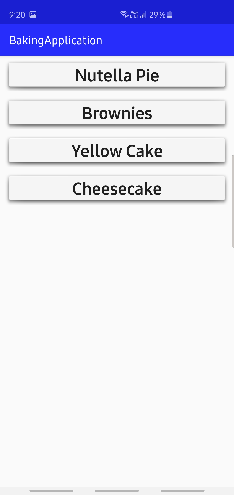
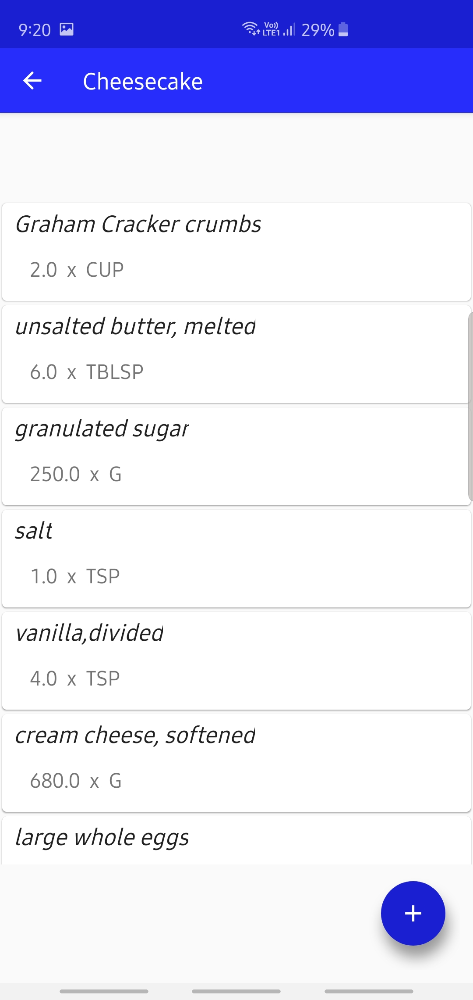
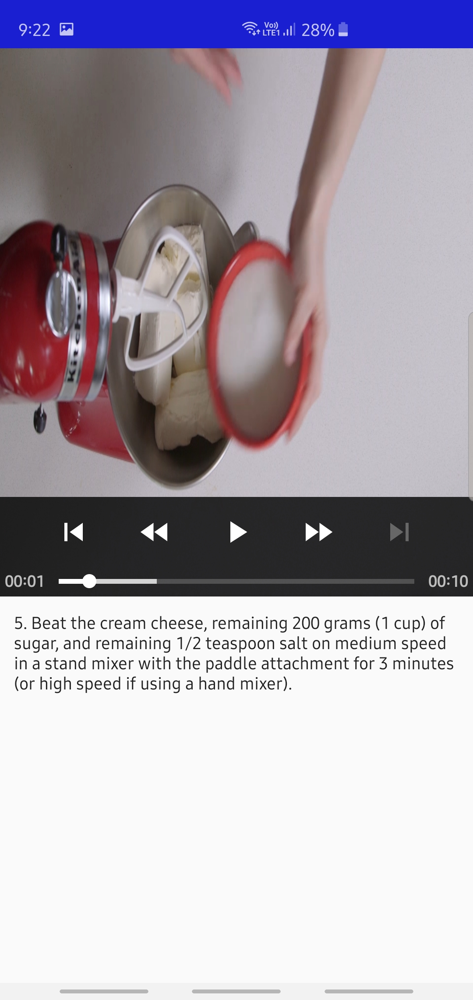
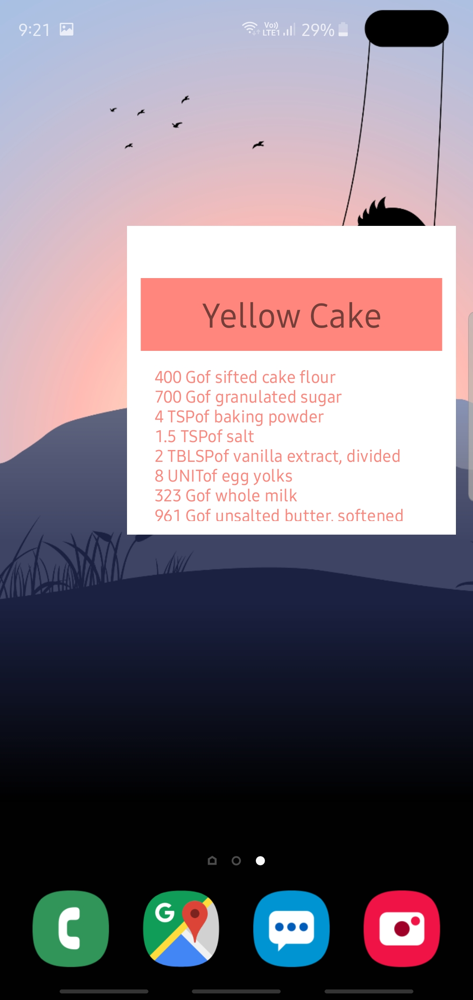

Baking Application

The Baking App is the Project No.4 of the Nanodegree program by Udacity.The main purpose of this Project is to create fragments 
and utilizing their power to combine multiple fragments in a single activity to build a multi-pane UI and reuse a fragment in 
multiple activities.

Features:

    Share Ingredients of a specific cake.
    Home Screen Widget.
    Add your Favorite Ingredients to the Home Screen Widget.
    Watch the Recipes on Video Player.
    Supports Multi-Screen sizes.

The Third Party Libraries used on this project:

    Android Support Libraries.
    Espresso Test Library.
    ButterKnife.
    Glide.
    Retrofit.
    Gson
    Timeline View.
    FloatingActionButtons.
    ExoPlayer.

